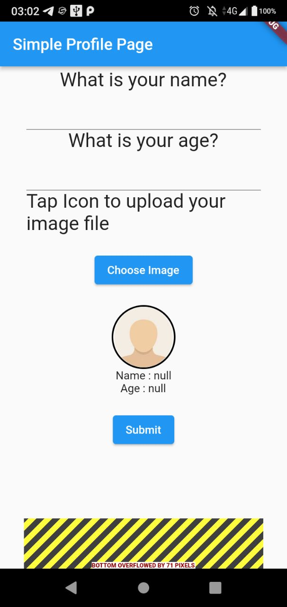
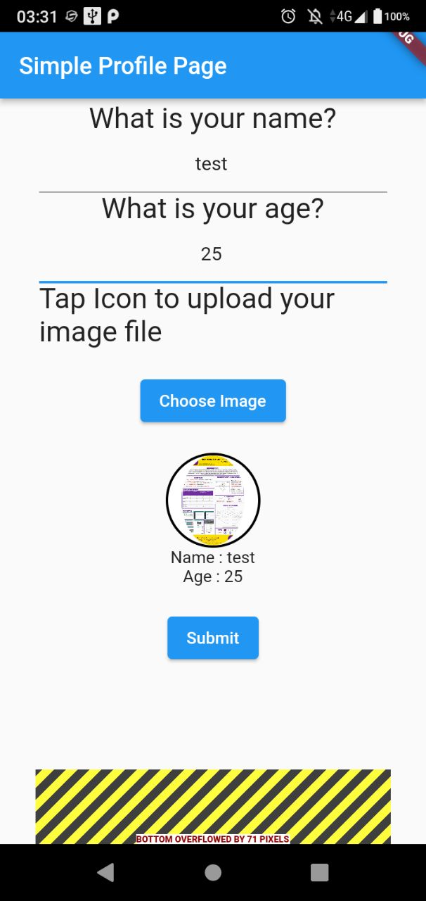

# Name : Syed Azamuddin bin Syed Ridhuan

# Matric No : 1928931

# Changelog

1. Add widget tree consisted of column,container,text,textfield, elevatedButton, Inkwell and clipOval widgets.
2. Add spacing using SizedBox widget.
3. Aligned to center mainAxisAlignment argument in column widget.
4. Add Asset (image) by updating pubspec.yaml.

# Difference from others

1. I am not sure where the differences as I have not refer any of my classmates's works but i used paddings and different widgets such as Inkwell and clipOval.

# Screenshots

1. Before inputting any inputs
   
2. After inputting name, age, picture
   

# Assignment: Simple Profile Page

Objective: Create a simple Flutter application that allows the user to enter their name, age, and upload a profile picture. The application should display the entered information on the same screen after the user presses a "Submit" button. Note that the code main.dart have been partially provided for you. Your job is too build the widget tree to create the following requirements.

Requirements:

1. Create a StatefulWidget called ProfilePage for the main screen of the application.
2. Inside the ProfilePage, use a Scaffold widget to create the basic layout structure.
3. Add an AppBar to the Scaffold with the title "Simple Profile Page".In the Scaffold body, use a Column widget to align the input fields, button, and display widgets vertically.
4. Add a TextField widget for the user to input their name. Use a TextEditingController to capture the input value.
5. Add a second TextField widget for the user to input their age. Set the keyboardType to TextInputType.number and use another TextEditingController to capture the input value.
6. Add a button (e.g., ElevatedButton, FlatButton, or TextButton) to allow the user to upload a profile picture. When the button is pressed, use a package such as image_picker to open the device's image gallery and select an image. Store the selected image in the state.
7. Add a "Submit" button (e.g., ElevatedButton, FlatButton, or TextButton) below the input fields. When pressed, update the state to display the entered name, age, and profile picture below the button.
8. Use a Text widget to display the user's entered name and age.
9. Use an Image widget to display the selected profile picture. If no picture is selected, show a default placeholder image.

# Tips:

Use setState() to update the state of the ProfilePage whenever the user selects a profile picture or presses the "Submit" button.
Remember to dispose of the TextEditingControllers in the dispose() method of your ProfilePage StatefulWidget.
This assignment will help you gain experience with creating a simple user interface using Flutter, working with StatefulWidgets, handling user input, and displaying images.

If you are using ImagePicker, you may need to add the image_picker package to your pubspec.yaml file.
